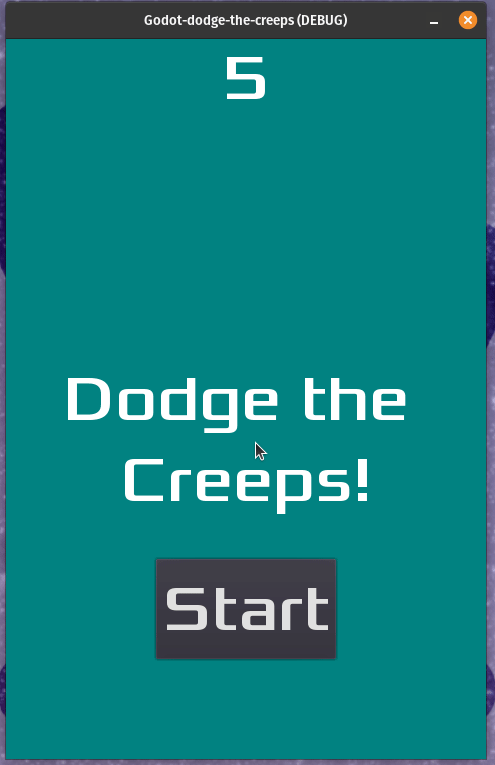

# Godot Dodge the Creeps!
This project is from the Godot game engine documentation. It is their 2D game tutorial for introducing people to their game engine. It creates a game that has a player controlled character, enimies that spawn randomly around the board, and score count and user interfaces and sound.

The tutorial can be found here: https://docs.godotengine.org/en/3.5/getting_started/first_2d_game/index.html

Example GIF:

